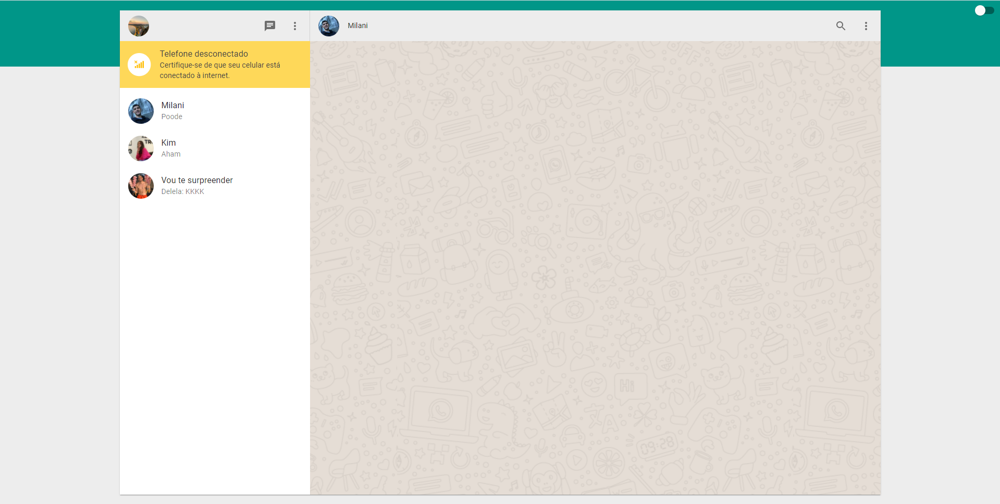
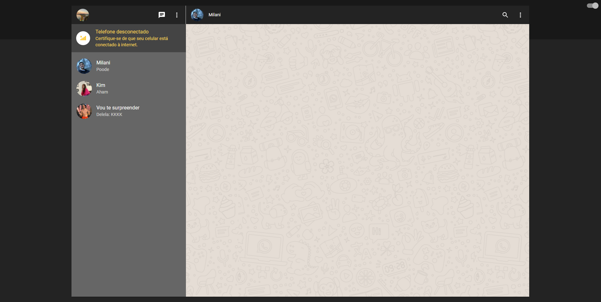

# Clone WhatsApp Web

  

  

## 💻 Aplicação

Pequenas coisas da interface do WhatsApp Web desenvolvidas a partir da leitura deste [artigo](https://blog.rocketseat.com.br/react-material-ui/), disponível para visualização [aqui](https://whatsapp-web-clone-felipebrenner.vercel.app/).

## 🚀 Feito a mais

- Refatorado e adicionado detalhes a mais, procurando se aproximar um pouco mais do real e explorando os recursos do Material-UI.
- Implementado dark theme.

---

Por Felipe Brenner
